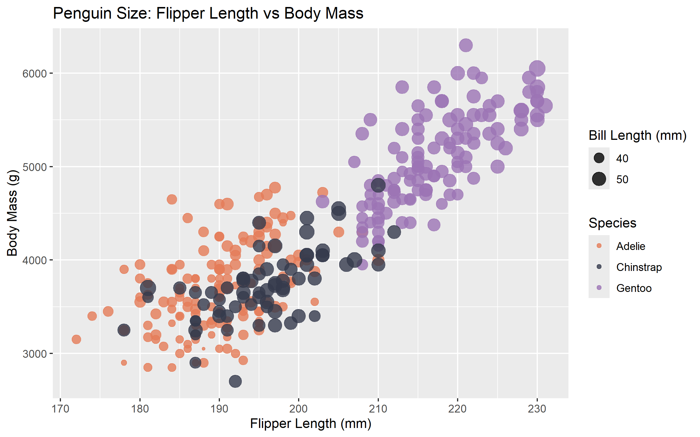
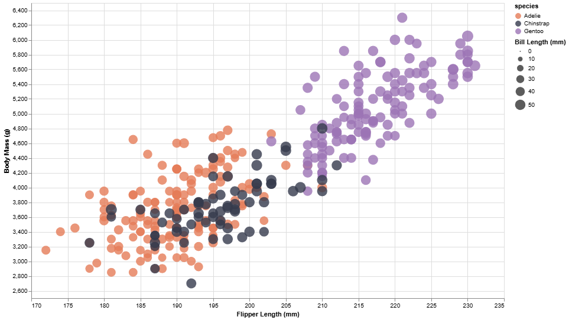
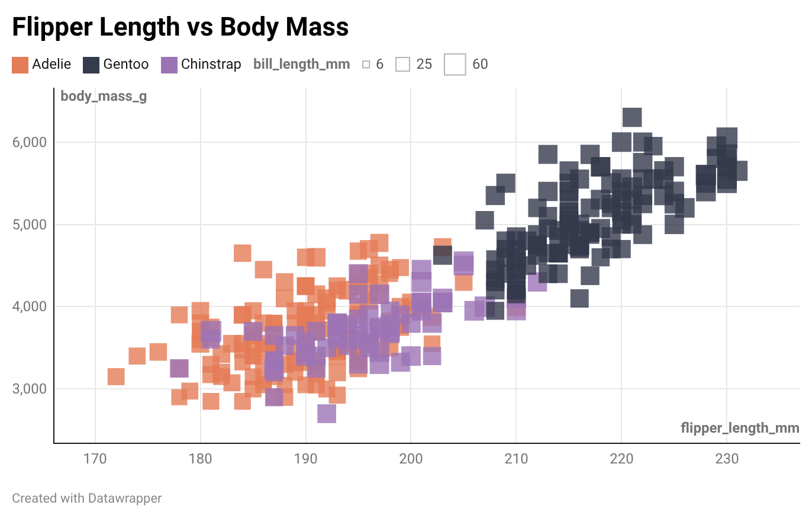
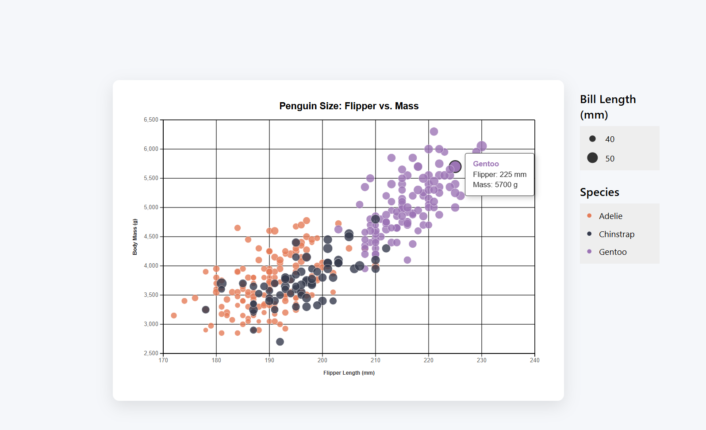
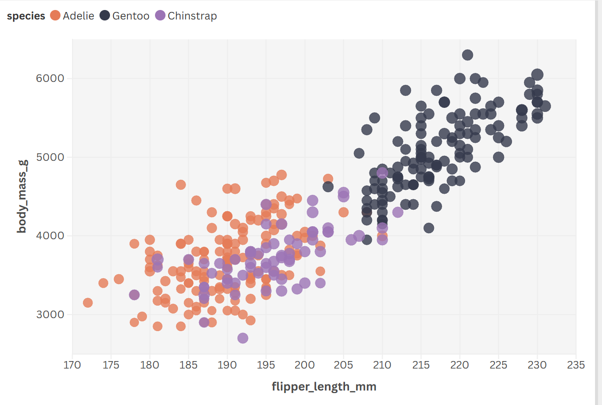

# 02-DataVis-5ways

Assignment 2 - Data Visualization, 5 Ways

## R + ggplot2

I used IntelliJ IDEA with the R Language Support plugin to create this visualization. For the difficulty thing are I had to use `na.omit()` to clean the dataset, or ggplot would produce warnings about rows being removed.
- Unlike RStudio, IntelliJ doesn't always show a plot window immediately, I resolved this by using `ggsave()` to export the image directly.
- 

## Python + Altair

For the second library, I selected Python and Altair. Although I frequently use Python, this marks my first attempt with this  visualization tool. One of Altair's strengths is how effortlessly interactive features can be added. Simply use the .interactive() method to enable zooming within the penguin colony visualization. Since I disliked the default export style, I wrote a Python script to wrap the chart in a standardized HTML/CSS container. Using Flexbox for centered layout and adding shadow effects.

## DataWrapper
After using Python and R, DataWrapper feels incredibly easy to use. I simply upload a CSV file, and this tool accurately guesses what I need. Moreover, this tool is extremely user-friendly for those without a coding background.

## d3js
D3 is the most complex part of this project. Unlike other tools, I had to build every element from scratch. I used a CONFIG object to manage my dimensions and colors globally, which made tweaking the layout much easier. I implemented a custom sidebar legend in HTML/CSS.I added a transition effect so that when you hover over a penguin, the dot grows in size and the border darkens, while a fixed tooltip follows your cursor exactly.

## Flourish
Flourish feels like an upgraded version of DataWrapper. While both are no-code tools, Flourish offers greater customization. After getting started, it exports charts faster than DataWrapper. However, as I mentioned earlier, Flourish isn't very user-friendly for first-time users，you have to manually select each element, unlike DataWrapper which automatically recognizes them.

## Technical Achievements
I wrote a custom HTML script that uses CSS Flexbox and shadows to center the visualization.
D3’s .then() promises to ensure the visualization only renders once the data is fully parsed, preventing empty chart errors.
Implemented a fixed position tooltip in D3 that uses event.pageX/Y to follow the mouse cursor with zero lag
## Design Achievements
I chose a specific palette (#E57C58, #353A4C, #9C74B5).
I set the opacity to 0.8 across all my charts.
In the DataWrapper version, I moved away from traditional circular markers and used squares instead.
In the D3 version, I added thicker grid lines to the dots to make it easier for users to estimate weight and fin length values.